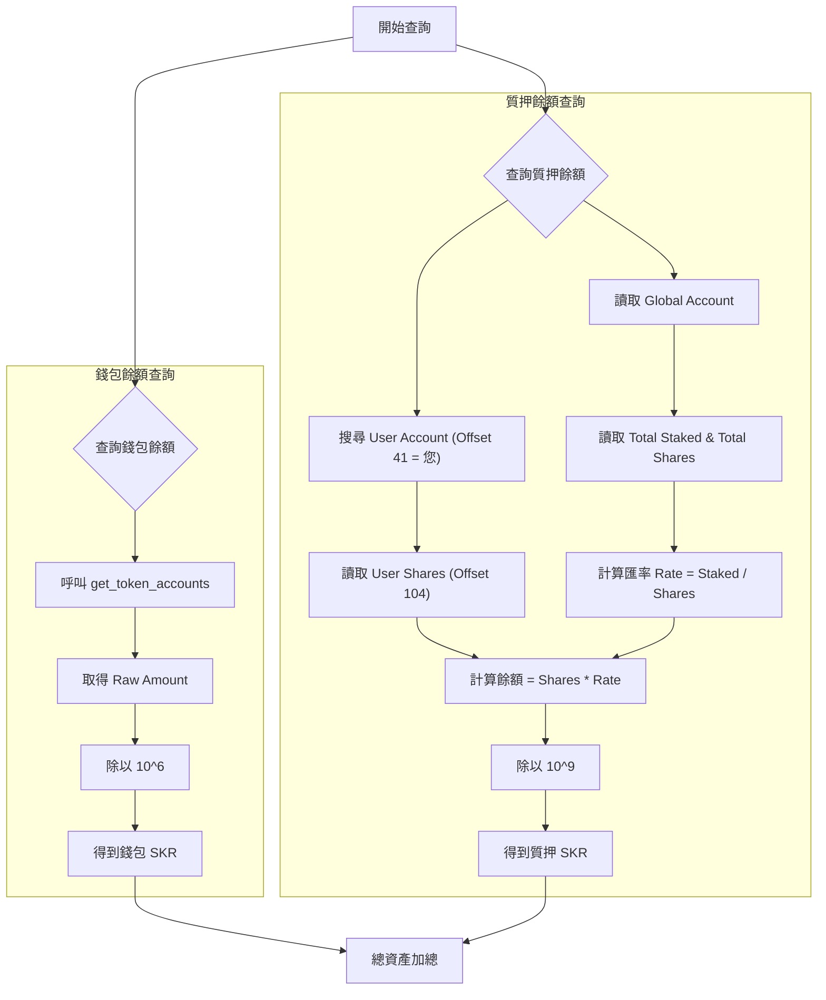

# SKR 查詢原理詳解 (Seeker Staking Logic)

這份文件詳細說明 `skr_staking_checker.py` 如何從 Solana 鏈上查詢您的 SKR 代幣餘額與質押狀態。

整個查詢過程分為兩個獨立的部分：

1. **錢包餘額 (Wallet Balance)**: 查詢標準的 SPL Token 帳戶。
2. **質押餘額 (Staked Balance)**: 查詢自定義質押合約 (Custom Program) 的內部狀態。

---

## 1. 錢包餘額查詢 (Wallet Balance)

這是最簡單的部分，查詢的是您錢包內尚未質押、可以自由轉移的代幣。

### 步驟原理：

1. **呼叫 RPC 方法**: `get_token_accounts_by_owner`
2. **參數**:
   - `owner`: 您的錢包地址 (例如 `Efxtw...`)
   - `mint`: SKR 的代幣地址 (`SKRbvo...`)
3. **回傳結果**:
   - Solana 會回傳該錢包持有的所有 SKR「Token Account」(代幣帳戶)。
   - 每個 Token Account 裡面記錄了 `amount` (原始數量)。

### 關鍵細節 (Decimals)：

- 鏈上的數字都是**整數**。
- SKR 的小數點位數 (Decimals) 是 **6** (我們之前修復的 bug 就在這裡)。
- **計算公式**:
  > 顯示餘額 = 原始數量 (Raw Amount) / 10^6
  > _範例_: 鏈上數據 `109721280` / 10^6 = `109.721280` SKR。

---

## 2. 質押餘額查詢 (Staked Balance)

這部分最複雜，因為 Seeker 的質押不是使用 Solana 原生的 Stake Program，而是使用自己寫的**自定義智能合約 (Smart Contract / Program)**。

**合約地址**: `SKRskrmtL83pcL4YqLWt6iPefDqwXQWHSw9S9vz94BZ`

我們無法直接問鏈「此人質押多少？」，必須透過以下步驟「算」出來：

### 步驟 A: 找到您的「用戶質押帳戶」 (User Stake Account)

當您質押時，合約會為您建立一個專屬的帳戶來記錄您的股份。

- **搜尋方法**: 使用 `get_program_accounts` 掃描合約下所有帳戶。
- **過濾條件 (Memcmp Filter)**:
  - 我們知道合約會在帳戶資料的特定位置 (Offset) 記錄「擁有者地址」。
  - 經過逆向工程分析，這個位置通常在 **Byte 41**。
  - **指令**: 「請給我所有由 `SKR 質押合約` 管理，且在第 41 個 Byte 寫著 `您的錢包地址` 的帳戶」。

### 步驟 B: 讀取您的「股份」 (User Shares)

找到帳戶後，我們讀取它的 Binary Data (二進位資料)。

- **User Shares 位置**: Offset 104 到 112 (8 bytes, Generic Integer)。
- 這代表您在整個質押池中佔有的「份額」，而不是直接的 SKR 數量。

### 步驟 C: 讀取「全域狀態」 (Global State)

為了知道一份「份額」值多少 SKR，我們需要讀取整個池子的總狀態。

- **全域帳戶地址**: `4aAEUKCcju9iAEAgdeaNz4RC7sCPv63q5g714nw4QY68` (這是所有用戶共用的唯一帳戶)。
- **讀取數據**:
  - **總質押量 (Total Staked)**: 位置 Offset 3616
  - **總發行份額 (Total Shares)**: 位置 Offset 1344

### 步驟 D: 計算匯率與真實餘額

由於質押會產生獎勵，池子裡的 SKR 會變多，但份額總數不變 (或者變動比例不同)，這導致「匯率」會隨時間增加。

1. **計算匯率 (Exchange Rate)**:

   > 匯率 = 總質押量 (Total Staked) / 總份額 (Total Shares)
   > _(這個匯率通常大於 1，代表 1 份額可以換回大於 1 的 SKR)_

2. **計算您的餘額**:

   > 您的質押餘額 = 您的份額 (User Shares) × 匯率

3. **格式化**: 最後同樣除以 10^9 (質押合約內部計算似乎是用 9 位精度，這也是為什麼程式碼這邊用 10^9)。

---

## 總結流程圖

這就是為什麼我們需要這段複雜的 Python Script，而不是簡單的一行指令。它其實是在模擬前端網頁與區塊鏈互動的邏輯。
